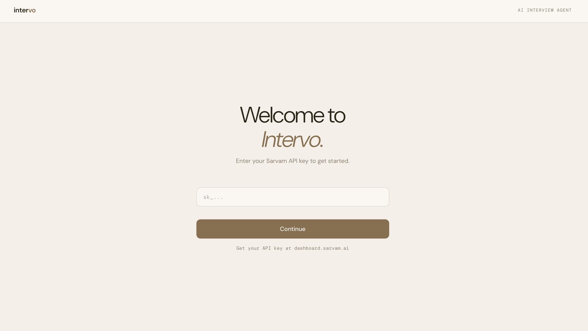
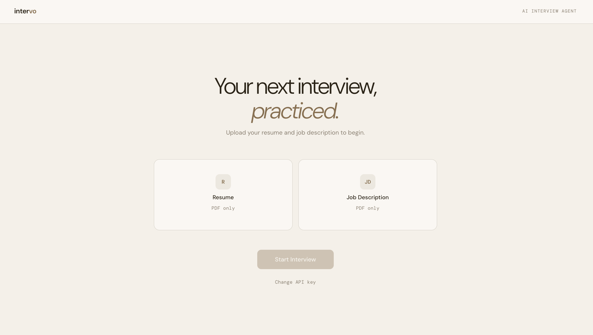
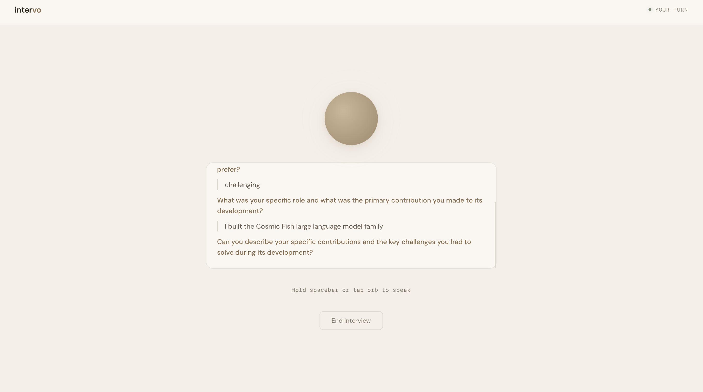
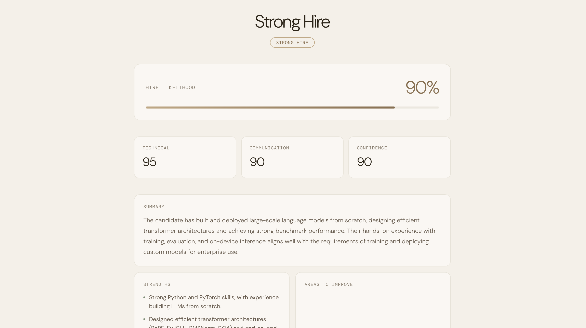

# Intervo

An AI-powered voice interview agent built with Sarvam's speech and language stack. Upload a resume and job description, conduct a full voice interview, and receive detailed feedback on your performance.

## Live Demo

https://intervo-ak1h.onrender.com

## How It Works

1. Enter your Sarvam API key
2. Upload your resume and job description as PDFs
3. The AI interviewer asks for your language preference and interview tone
4. A voice interview is conducted, fully driven by the AI
5. After the interview ends, you receive a detailed evaluation with hire likelihood, scores, and feedback

## Tech Stack

- **Backend** - FastAPI (Python)
- **Frontend** - HTML, CSS, vanilla JavaScript
- **Speech to Text** - Sarvam Saaras V3
- **Text to Speech** - Sarvam Bulbul V3
- **Language Model** - Sarvam 30B
- **PDF Parsing** - PyMuPDF

## Prerequisites

- Python 3.9 or higher
- A Sarvam API key from [dashboard.sarvam.ai](https://dashboard.sarvam.ai)

## Local Setup

Clone the repository:

```bash
git clone https://github.com/akkii2006/Intervo.git
cd intervo
```

Create and activate a virtual environment:

```bash
python -m venv venv
source venv/bin/activate
```

Install dependencies:

```bash
pip install -r requirements.txt
```

Run the server:

```bash
uvicorn main:app --reload
```

Open [http://localhost:8000](http://localhost:8000) in your browser.

## Project Structure

```
intervo/
├── main.py               # FastAPI routes
├── interview_engine.py   # Interview state and logic
├── sarvam_client.py      # Sarvam API calls (STT, TTS, LLM)
├── resume_parser.py      # PDF text extraction
├── prompts.py            # LLM prompts
├── requirements.txt
└── static/
    ├── index.html        # Upload and API key screen
    ├── interview.html    # Voice interview screen
    ├── feedback.html     # Results screen
    ├── style.css         # Styles
    └── app.js            # Frontend logic
```

## API Key

Your Sarvam API key is stored locally in your browser's localStorage and sent as a request header to the backend. It is never stored on the server.

Get your key at [dashboard.sarvam.ai](https://dashboard.sarvam.ai). The starter plan is sufficient to run interviews.

## Supported Languages

Any language supported by Sarvam's speech stack, including English, Hindi, Tamil, Telugu, Kannada, Malayalam, Bengali, Marathi, Gujarati, Punjabi, and more. The AI will ask your language preference at the start of each interview.

## Notes

- Sessions are stored in memory. Restarting the server ends any active sessions.
- Audio recordings are capped at 30 seconds per response due to Sarvam API limits.
- The AI decides when to end the interview, typically after 6 to 10 questions.
- The starter plan on Sarvam has a 4096 token limit per request.

## Screenshots









## License

MIT
